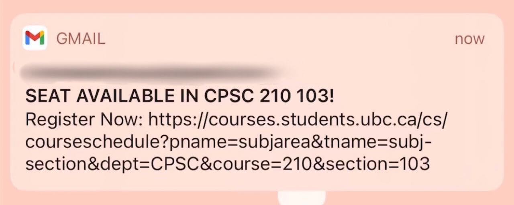

# waitlistNotifier
Allows user to input a specific course section URL, as well as their name, and email information in order to notify
them of (general) seat availability in the course. The program will run indefinitely until availability has been found, and will
refresh every 15 minutes upon after running. User will be notified of seat availability via email they have inputted.

# Warnings
Created by Kiara Melocoton on July 15, 2021. Built for educational purposes only, I am not responsible for individuals' misuse of this program.
Use of this program may breach the terms and services of UBC's SSC, and may result in punishment.

# Setup
Gmail account is required for the email notifications, and the unique authentication password for apps is used, and
must be first configured by the user through navigating: Gmail -> Account -> Security
